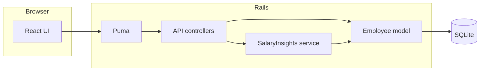

# Architecture

## Overview

The app is a **Rails 7 JSON API** plus a **React 18** SPA rendered on the root page via **Vite Ruby**. **SQLite** holds employee rows. There is no separate BFF: the browser calls `/api/v1/*` on the same origin.

## Backend

- **`Employee`**: validations (presence, salary > 0, email uniqueness, country allow-list), `as_api_json` for stable API shape.
- **`Api::V1::EmployeesController`**: paginated index with optional country and text search; CRUD for a single resource.
- **`SalaryInsights`**: server-side aggregates (`COUNT`, `MIN`, `MAX`, `AVG`, `SUM`) with optional job-title filter and a capped job-title breakdown for exploration in the UI.

## Frontend

- **`App.jsx`**: two tabs—employees (table + modal forms) and salary insights (country selector, optional exact job title, refresh).
- **Tailwind CSS**: utility-first styling without a heavy component kit.

## Seeding

- **`Employees::BulkSeeder`**: reads `db/data/first_names.txt` and `db/data/last_names.txt`, composes full names, batches **`insert_all!`** (1,000 rows) for repeatable, fast loads suitable for frequent runs.
